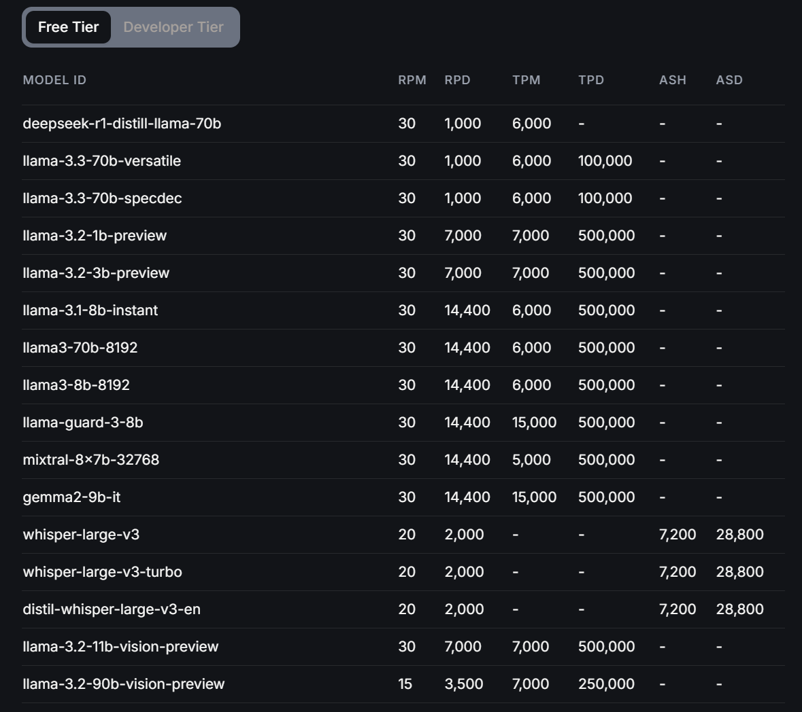

# GPT Cheat Tool

## About

**GPT Cheat Tool** is a real-time audio transcription tool that listens to both your microphone and speakers. It uses the LLM model to generate answers, making it ideal for cheating during interviews or exams. But perhaps you can find a more ethical use for it. Currently only Groq platform is supported.

This software has been tested only on Windows. While it might run on macOS or Linux, compatibility is not guaranteed. Your feedback is highly appreciated — feel free to review the source code or contact me with any questions.

## Installation & Setup

### Prerequisites

Before you begin, ensure you have the following:

* **Python 3.10.6+** (May work on lower versions, not tested)
* **Windows OS** (Not tested on other OS)
* **Groq API Key**

### Make Groq free account

Visit [Groq website](https://groq.com/) and create a free acount. Go to the [API keys page](https://console.groq.com/keys) and create one. Save it for later.



Rate limits are measured in:

* **RPM:** Requests per minute
* **RPD:** Requests per day
* **TPM:** Tokens per minute
* **TPD:** Tokens per day

According to [token usage DeepSeek page](https://api-docs.deepseek.com/quick_start/token_usage/) 1 English letter ≈ 0.3 token.

By default, the application uses:

* `deepseek-r1-distill-llama-70b` for text generation.
* `whisper-large-v3-turbo` for transcribing messages.

You can modify these settings in the `settings.json` file to use different models.

## Installation

Follow these steps to set up the project:

1. **Clone the Repository:**

   ```bash
   git clone https://github.com/Maximax67/gpt-cheat-tool.git
   cd gpt-cheat-tool
   ```

2. **Configure Your API Key:**

   - Open the `.env.example` file.
   - Replace `<your-api-key-here>` with your actual Groq API key.
   - Rename the file to `.env`.

3. **Install Dependencies:**

   ```bash
   pip install -r requirements.txt --ignore-requires-python
   ```

4. **Run the Application:**

   ```bash
   python app.py
   ```

## Building Executables

For users interested in distributing the application, you can build standalone executables using [PyInstaller](https://pyinstaller.readthedocs.io/). A pre-configured `app.spec` file is provided in the repository to help you get started.

1. Install PyInstaller from PyPI:

   ```bash
   pip install -U pyinstaller
   ```

2. Install [UPX](https://upx.github.io/) for lower build size.

3. Run installer:

   ```bash
   pyinstaller app.spec --upx-dir="<paste-here-path-to-upx-dir>"
   ```

The excecutable file will be in folder `dist/GPT Cheat Tool`. Please note that this is One-Folder installation. Do not delete `_internal` folder. You can also make one-file build. But you need to edit `app.spec` file by removing COLLECT call and passing all of the scripts, modules and binaries to the EXE instance.

## Hide app window during screen sharing (Windows only)

You can use [Invisiwind](https://github.com/radiantly/Invisiwind) to hide any window during screensharing. The tool performs dll injection to [SetWindowDisplayAffinity](https://docs.microsoft.com/en-us/windows/win32/api/winuser/nf-winuser-setwindowdisplayaffinity) to `WDA_EXCLUDEFROMCAPTURE`. It works with any app: Zoom, MS Teams, Discord, OBS, etc. Follow installation [guide](https://github.com/radiantly/Invisiwind?tab=readme-ov-file#how-do-i-install-it). I recommend to use the installer.

### Hide and unhide any window by hotkey

I wrote simple script that hides windows by pressing `Ctrl+M` and unhides them by pressing `Ctrl+K`. To use it follow these steps:

1. Download and install [Invisiwind](https://github.com/radiantly/Invisiwind).
2. Download and install [AutoHotkey](https://www.autohotkey.com/) v2.0 or above.
3. Navigate to `C:\Program Files\Invisiwind` and create `script.ahk` file. You can change the filename, but the file extension should be `.ahk`.
4. Open it using Notepad and paste script below, press `Ctrl+S` to save:

    ```
    ^m:: 
    {
        pid := WinGetPID("A")
        processName := WinGetTitle("A")

        if (InStr(processName, "Program Manager") or InStr(processName, "File Explorer"))
        {
            result := MsgBox("It's not recommended to hide this window: " processName ". Are you    sure you want to continue?", "Hide window", "YesNo Icon! Default2")
        }
        else
        {
            result := MsgBox("Do you want to hide: " processName " (PID: " pid ")?", "Hide  window", "YesNo Iconi")
        }

        if (result = "Yes")
        {
            Run('Invisiwind.exe --hide ' pid, "C:\Program Files\Invisiwind", "Hide")
        }
    }

    ^k:: 
    {
        pid := WinGetPID("A")
        processName := WinGetTitle("A")

        if (InStr(processName, "Program Manager") or InStr(processName, "File Explorer"))
        {
            result := MsgBox("If you try to unhide this window, additional system pop ups may   appear: " processName ". Are you sure you want to continue?", "Unhide window",    "YesNo Icon! Default2")
        }
        else
        {
            result := MsgBox("Do you want to unhide: " processName " (PID: " pid ")?", "Unhide  window", "YesNo Iconi")
        }

        if (result = "Yes")
        {
            Run('Invisiwind.exe --unhide ' pid, "C:\Program Files\Invisiwind", "Hide")
        }
    }
    ```

5. Right click on the file and choose create shortcut option.
6. Double click on the appeared shourcut on the Desktop.

Now the script is running. Press `Ctrl+M` to hide the current window and `Ctrl+K` to unhide it. You can also remove confirmation message boxes by modifying my script.

## Configuration

The application's behavior can be customized through the `settings.json` file. Below is a sample configuration:

```json
{
    "chat": {
        "text_generator": {
            "provider": "Groq",
            "prompt": null,
            "message_context": 5,
            "model": "deepseek-r1-distill-llama-70b",
            "temperature": null,
            "max_tokens": null,
            "top_p": null,
            "stream": true,
            "timeout": 30.0
        }
    },
    "quick_answers": {
        "default_message": "Welcome to the ChatGPT cheat tool!",
        "text_generator": {
            "provider": "Groq",
            "prompt": null,
            "message_context": 5,
            "model": "deepseek-r1-distill-llama-70b",
            "temperature": null,
            "max_tokens": null,
            "top_p": null,
            "stream": true,
            "timeout": 30.0
        }
    },
    "transcription": {
        "speaker": {
            "device_index": null,
            "transcriber": {
                "provider": "Groq",
                "model": "whisper-large-v3-turbo",
                "language": null,
                "temperature": null,
                "timeout": 30.0,
                "sample_rate": 16000,
                "sample_width": 2
            },
            "phrase_timeout": 5.0,
            "max_phrase_length": 17.0,
            "record_timeout": 4.0,
            "energy_threshold": 1000.0,
            "dynamic_energy_threshold": false,
            "messages": {
                "init_message": "[ Initializing ]",
                "adjust_noise_message": "[ Adjusting for ambient noise ]",
                "init_error": "Recorder init error: {}"
            }
        },
        "mic": {
            "device_index": null,
            "transcriber": {
                "provider": "Groq",
                "model": "whisper-large-v3-turbo",
                "language": null,
                "temperature": null,
                "timeout": 30.0,
                "sample_rate": 16000,
                "sample_width": 2
            },
            "phrase_timeout": 5.0,
            "max_phrase_length": 17.0,
            "record_timeout": 4.0,
            "energy_threshold": 1000.0,
            "dynamic_energy_threshold": false,
            "messages": {
                "init_message": "[ Initializing ]",
                "adjust_noise_message": "[ Adjusting for ambient noise ]",
                "init_error": "Recorder init error: {}"
            }
        }
    },
    "logging_level": "INFO",
    "theme": "auto"
}
```

You can modify these settings to adjust the transcription and response generation parameters to suit your needs.

## License

This project is licensed under the [MIT License](LICENSE). 
